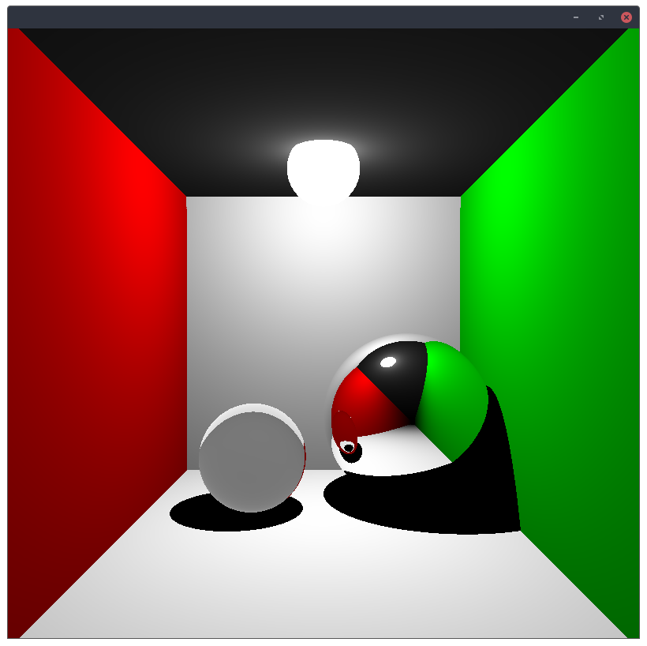
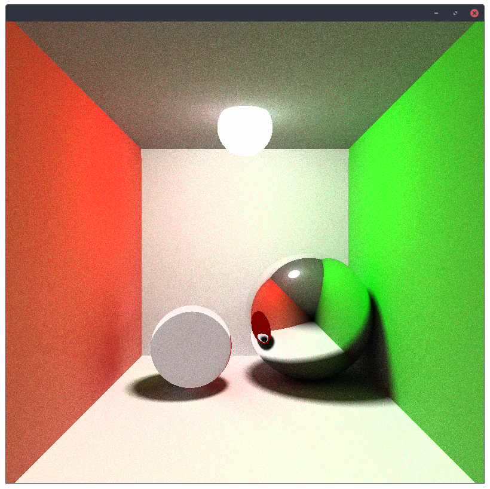
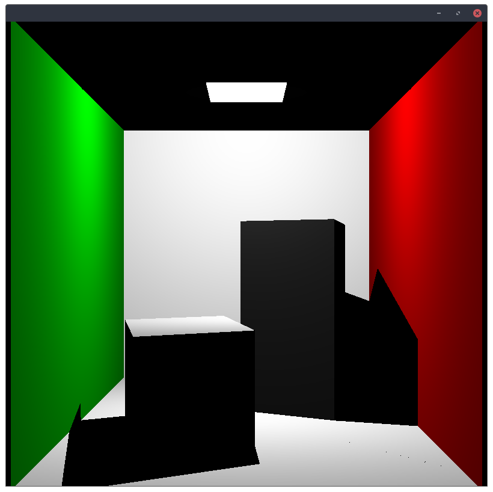
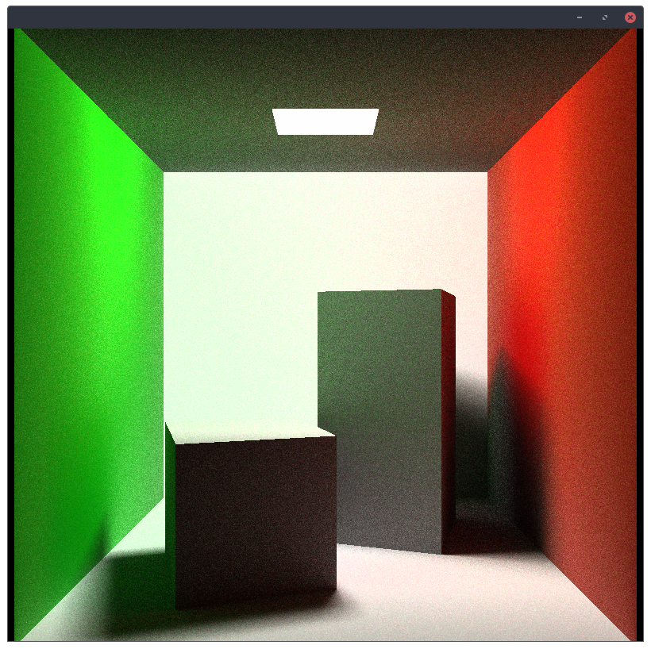

# Trivial Tracer

To compile the project run `make compile`.
To start the tracers run `make run`.

Run options can be passed through environment variables, the are:
- `CORNEL=true` : Run the cornel room example instead of the spheres room.
- `PATH_TRACE=true` : Uses a path tracer instead of a ray tracer.
- `THREADS=true` : Enables multi-threading. 

#### Examples:
```shell
$ make run
$ CORNEL=true make run
$ PATH_TRACE=true make run
$ CORNEL=true PATH_TRACE=true THREADS=true make run
```

### Spheres Room

Ray tracing



Path tracing



### Cornel Room

Ray tracing



Path tracing


